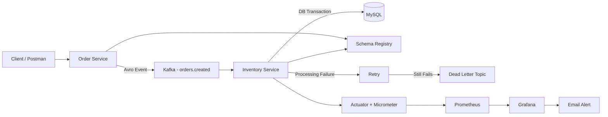
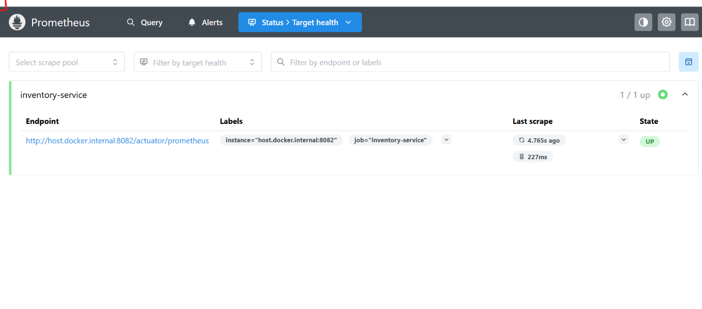
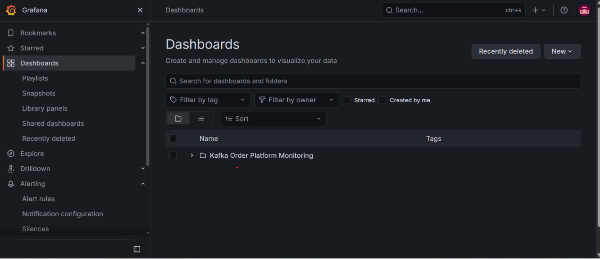
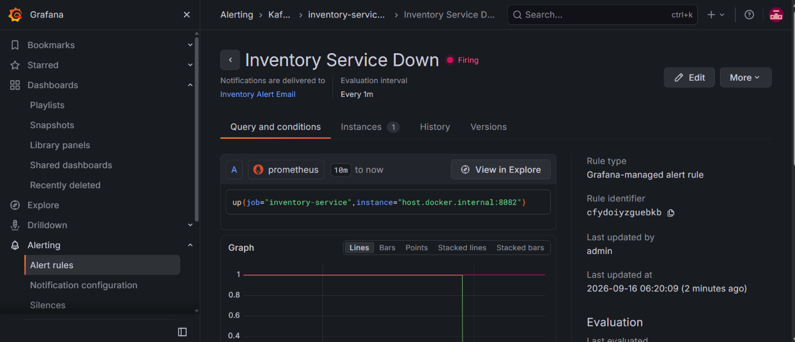
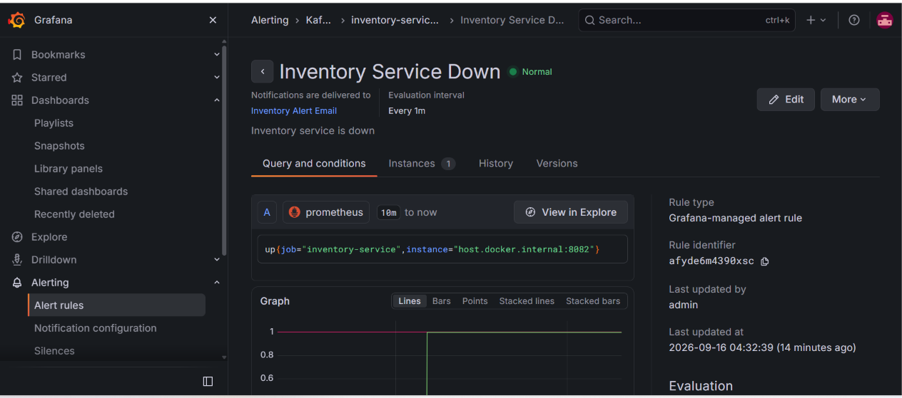

# Kafka Order Platform

A Spring Boot event-driven order processing platform using Apache Kafka.

The order-service publishes Avro order events to Kafka.
The inventory-service consumes them, updates inventory inside a MySQL transaction,
prevents duplicate processing, manually acknowledges Kafka offsets,
retries failed records, and sends unrecoverable records to DLT.

The platform is monitored using Spring Boot Actuator, Micrometer,
Prometheus and Grafana with email alerts for service failures.

## Tech Stack

- Java 17
- Spring Boot
- Spring Kafka
- Apache Kafka
- Apache Avro
- Schema Registry
- Spring Data JPA
- Hibernate
- MySQL
- Maven
- Docker Compose
- Spring Boot Actuator
- Micrometer
- Prometheus
- Grafana
- ## Architecture


## Normal Processing Flow

1. Client sends an order request to `order-service`.
2. `order-service` creates an Avro order event.
3. The event is published to the Kafka topic `orders.created`.
4. `inventory-service` consumes the event.
5. The consumer checks whether the event was already processed.
6. Inventory is updated inside a MySQL transaction.
7. Processed event details are saved for idempotency.
8. After successful database commit, the Kafka offset is manually acknowledged.
## Duplicate / Idempotency Flow

1. `inventory-service` receives an event from Kafka.
2. It checks the `processed_event` table using the event ID.
3. If the event ID already exists, the event is treated as a duplicate.
4. Inventory is not updated again.
5. The duplicate event is skipped safely.
6. The Kafka offset is acknowledged so the same record is not processed repeatedly.
## Retry + DLT Flow

1. `inventory-service` consumes an event from Kafka.
2. If business processing fails, the record is not acknowledged.
3. Kafka retries the failed record according to the configured retry policy.
4. If processing still fails after the retry attempts, the record is sent to the Dead Letter Topic (DLT).
5. The failed record is isolated in the DLT so the consumer can continue processing other records.
6. The DLT record can be inspected and reprocessed later after the issue is fixed.
## Avro + Schema Registry

- Order events are serialized using Apache Avro before being published to Kafka.
- Avro provides a structured schema for event data.
- Schema Registry stores and manages the Avro schemas used by producers and consumers.
- `order-service` uses the schema while producing events.
- `inventory-service` uses the corresponding schema while consuming events.
- This keeps the event structure consistent between services and helps avoid incompatible message formats.
## Database Transaction + Manual Acknowledgment

- Inventory processing runs inside a MySQL transaction.
- Inventory update and processed-event tracking are committed together.
- Kafka acknowledgment is done manually only after successful business processing.
- If processing fails, the offset is not acknowledged.
- This allows Kafka to retry the record instead of treating it as successfully processed.
## Monitoring & Alerting

- Spring Boot Actuator exposes application health and runtime metrics.
- Micrometer converts application metrics into Prometheus-compatible metrics.
- Prometheus scrapes metrics from `inventory-service`.
- Grafana visualizes CPU usage, JVM heap memory, and service availability.
- A Grafana alert monitors the `up` metric for `inventory-service`.
- If the service goes down, Grafana sends an email alert through Gmail SMTP.
- When the service becomes healthy again, Grafana sends a resolved notification.
- Grafana data is stored in a persistent Docker volume so dashboards and alert configuration survive container recreation.
## How to Run

### Prerequisites

- Java 17
- Docker Desktop
- Maven / Maven Wrapper
- MySQL

### 1. Start Infrastructure

From the project root:

```powershell
docker compose up -d
```

This starts the Kafka cluster, Schema Registry, Prometheus, and Grafana.

### 2. Start Inventory Service

```powershell
cd inventory-service
.\mvnw.cmd spring-boot:run
```

`inventory-service` runs on port `8082`.

### 3. Start Order Service

Open another terminal:

```powershell
cd order-service
.\mvnw.cmd spring-boot:run
```

### 4. Verify Monitoring

Prometheus:

```text
http://localhost:9090
```

Grafana:

```text
http://localhost:3000
```
## Environment Setup

Create a local `.env` file in the project root:

```env
GRAFANA_SMTP_PASSWORD=YOUR_GMAIL_APP_PASSWORD
```

The real `.env` file is ignored by Git and should never be committed.

A safe template is provided in:

```text
.env.example
```

Grafana reads the password through Docker Compose:

```yaml
GF_SMTP_PASSWORD: "${GRAFANA_SMTP_PASSWORD}"
```

This keeps the Gmail App Password outside the repository.
## Screenshots

### Prometheus Target Health


### Grafana Monitoring Dashboard


### Service Down Alert


### Service Recovery
