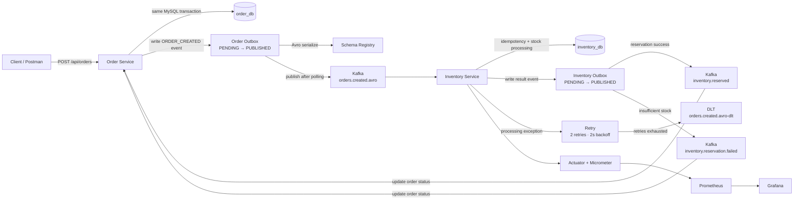
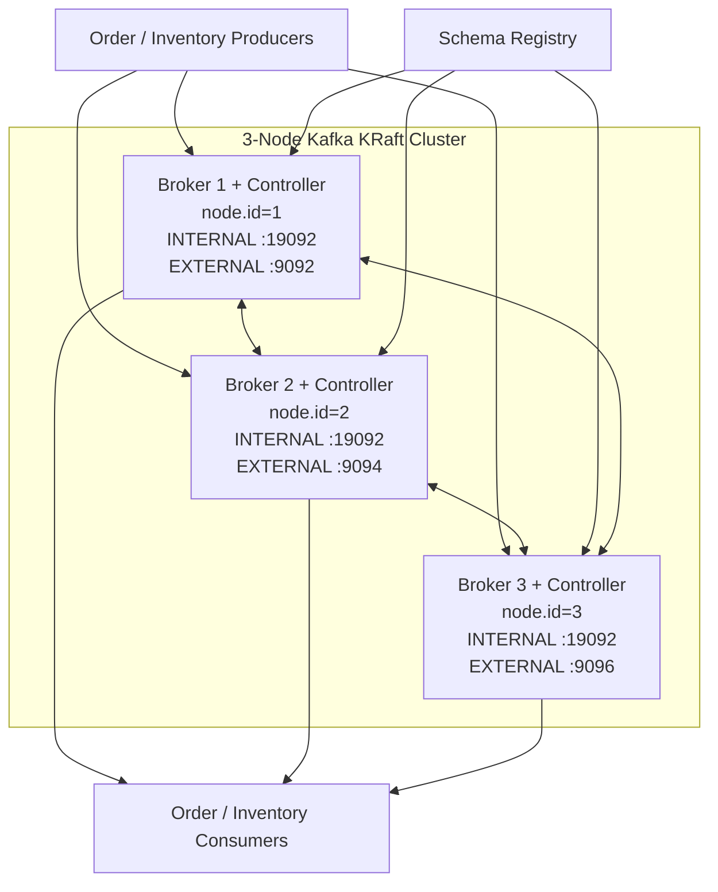
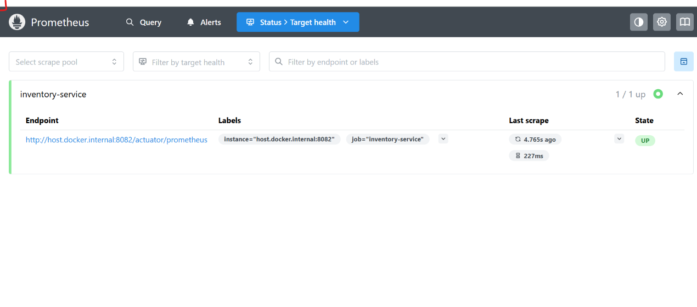
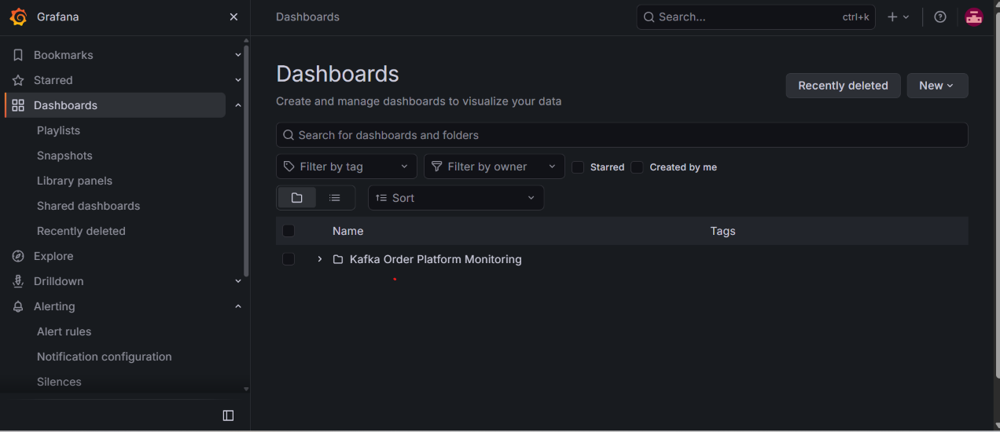
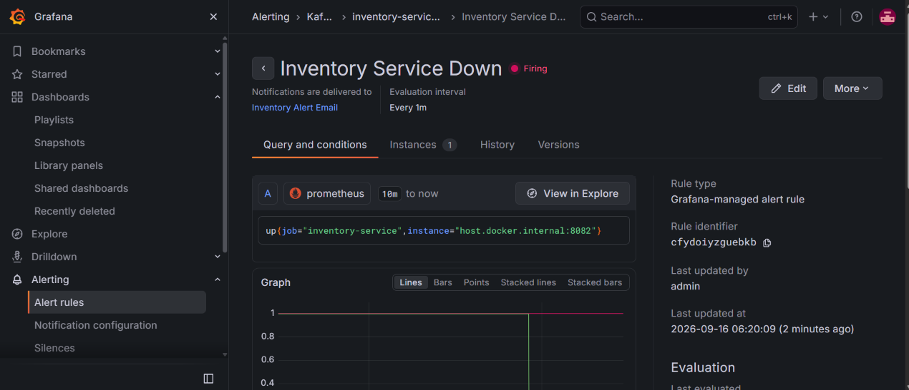
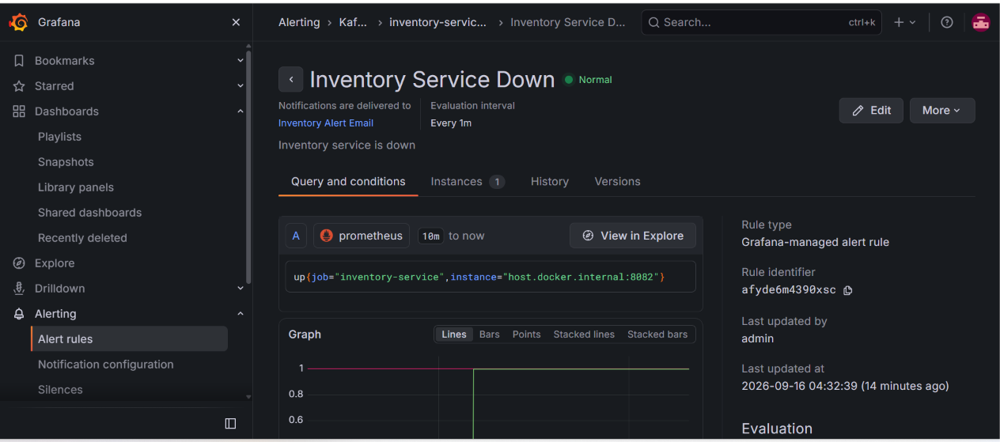

# Kafka Order Platform

## Project Overview

Kafka Order Platform is an event-driven backend project built with Java 17, Spring Boot, Apache Kafka, MySQL, Avro, and Docker.

The project contains two independent Spring Boot services:

- **order-service** — accepts order requests, stores order state in MySQL, writes events using the Transactional Outbox pattern, and publishes Avro events to Kafka.
- **inventory-service** — consumes Kafka events, validates and updates inventory inside a MySQL transaction, prevents duplicate processing, and manually acknowledges Kafka offsets after successful processing.

The platform implements production-style reliability and delivery practices such as:

- 3-node Kafka KRaft cluster
- Transactional Outbox pattern
- At-least-once event delivery
- Idempotent consumer processing
- Manual Kafka acknowledgment
- Retry with fixed backoff
- Dead Letter Topic (DLT)
- Avro serialization with Schema Registry
- MySQL transactional processing
- Spring Boot Actuator and Micrometer
- Prometheus and Grafana monitoring
- Service-down alerting and recovery notification
- Dockerized services and infrastructure
- Jenkins CI/CD pipeline
- GitHub webhook-based automatic build triggering
- Versioned Docker images
- Docker Hub image publishing
- Approval-based deployment
- Post-deployment health verification

The goal of this project is not only to demonstrate a working Kafka producer-consumer flow, but also to show how common production-style failure scenarios—such as duplicate delivery, consumer crashes, publishing failures, retry exhaustion, schema communication delays, deployment failures, and service outages—can be handled, observed, and verified.

## Tech Stack

- Java 17
- Spring Boot
- Spring Kafka
- Apache Kafka
- Apache Avro
- Schema Registry
- Spring Data JPA
- Hibernate
- MySQL
- Maven
- Docker Compose
- Spring Boot Actuator
- Micrometer
- Prometheus
- Grafana
## Project Structure

```text
kafka-order-platform/
├── order-service/        # Produces order events
├── inventory-service/    # Consumes events and updates inventory
├── monitoring/           # Prometheus configuration
├── scripts/              # DLT and failure-testing scripts
├── docs/screenshots/     # Runtime proof screenshots
├── docker-compose.yml    # Kafka, Schema Registry, Prometheus and Grafana
├── .env.example          # Environment variable template
└── README.md
```

## Final Runtime Architecture

The runtime flow uses the Transactional Outbox pattern on both business sides so database changes and outgoing events are not treated as one unsafe dual-write operation.


```mermaid
flowchart LR
    Client[Client / Postman]
    OrderService[Order Service]
    OrderDB[(order_db)]
    OrderOutbox[Order Outbox\nPENDING → PUBLISHED]
    Schema[Schema Registry]
    KafkaOrder[Kafka\norders.created.avro]
    InventoryService[Inventory Service]
    InventoryDB[(inventory_db)]
    InventoryOutbox[Inventory Outbox\nPENDING → PUBLISHED]
    Reserved[Kafka\ninventory.reserved]
    Rejected[Kafka\ninventory.reservation.failed]
    Retry[Retry\n2 retries · 2s backoff]
    DLT[DLT\norders.created.avro-dlt]

    Actuator[Actuator + Micrometer]
    Prometheus[Prometheus]
    Grafana[Grafana]

    Client -->|POST /api/orders| OrderService
    OrderService -->|same MySQL transaction| OrderDB
    OrderService -->|write ORDER_CREATED event| OrderOutbox
    OrderOutbox -->|Avro serialize| Schema
    OrderOutbox -->|publish after polling| KafkaOrder

    KafkaOrder --> InventoryService
    InventoryService -->|idempotency + stock processing| InventoryDB
    InventoryService -->|write result event| InventoryOutbox

    InventoryOutbox -->|reservation success| Reserved
    InventoryOutbox -->|insufficient stock| Rejected

    Reserved -->|update order status| OrderService
    Rejected -->|update order status| OrderService

    InventoryService -->|processing exception| Retry
    Retry -->|retries exhausted| DLT

    InventoryService --> Actuator
    Actuator --> Prometheus
    Prometheus --> Grafana
```

### End-to-End Business Flow

1. The client sends `POST /api/orders` to `order-service`.
2. `order-service` stores the order and an `ORDER_CREATED` outbox row in MySQL within the same transaction.
3. The Order Outbox Publisher reads `PENDING` rows, converts the event to Avro, uses Schema Registry, and publishes to `orders.created.avro`.
4. After Kafka acknowledges the send, the outbox row is marked `PUBLISHED`; failed sends remain eligible for retry.
5. `inventory-service` consumes the Avro event, checks `eventId` for duplicate processing, and performs inventory work inside its MySQL transaction.
6. The inventory transaction also creates an outgoing result event in its outbox:
   - `inventory.reserved` when stock is reserved.
   - `inventory.reservation.failed` when stock is insufficient.
7. The Inventory Outbox Publisher publishes the result event to Kafka.
8. `order-service` consumes the result and updates the order to `INVENTORY_RESERVED` or `INVENTORY_REJECTED`.
9. Source-event processing uses manual acknowledgment; processing exceptions follow the configured retry policy and are recovered to `orders.created.avro-dlt` after retries are exhausted.
10. Actuator and Micrometer expose runtime metrics that Prometheus scrapes and Grafana visualizes.

### Reliability Boundaries

- **Order creation + order outbox:** one local MySQL transaction.
- **Inventory update + processed-event tracking + inventory outbox:** one local MySQL transaction.
- **Kafka delivery:** at-least-once, so consumers use `eventId`-based idempotency.
- **Kafka offset acknowledgment:** performed only after successful listener processing.
- **Outbox publication:** a row becomes `PUBLISHED` only after the Kafka send completes successfully.
- **Failure isolation:** bounded retries are followed by DLT recovery instead of infinite retry.

## Kafka Cluster Architecture

The local platform runs a **3-node Apache Kafka 4.3.1 KRaft cluster**. Each Kafka container is configured with both `broker` and `controller` roles, so the cluster does not depend on ZooKeeper.


```mermaid
flowchart TB
    Producer[Order / Inventory Producers]

    subgraph KafkaCluster[3-Node Kafka KRaft Cluster]
        B1[Broker 1 + Controller\nnode.id=1\nINTERNAL :19092\nEXTERNAL :9092]
        B2[Broker 2 + Controller\nnode.id=2\nINTERNAL :19092\nEXTERNAL :9094]
        B3[Broker 3 + Controller\nnode.id=3\nINTERNAL :19092\nEXTERNAL :9096]
    end

    Consumer[Order / Inventory Consumers]
    Registry[Schema Registry]

    Producer --> B1
    Producer --> B2
    Producer --> B3

    B1 <--> B2
    B2 <--> B3
    B3 <--> B1

    B1 --> Consumer
    B2 --> Consumer
    B3 --> Consumer

    Registry --> B1
    Registry --> B2
    Registry --> B3
```

### KRaft Controller Quorum

All three nodes participate in the controller quorum:

```text
1@kop-kafka-1:19093
2@kop-kafka-2:19093
3@kop-kafka-3:19093
```

KRaft manages Kafka cluster metadata and controller elections. Business records are still written to topic partition leaders and replicated between brokers.

### Internal vs External Listeners

Each broker exposes separate listeners for Docker-internal communication and Windows-host access.

| Broker | Docker internal listener | Host access |
|---|---|---|
| `kop-kafka-1` | `kop-kafka-1:19092` | `localhost:9092` |
| `kop-kafka-2` | `kop-kafka-2:19092` | `localhost:9094` |
| `kop-kafka-3` | `kop-kafka-3:19092` | `localhost:9096` |

The Spring Boot services use the host ports when running directly on Windows. When Jenkins deploys the services as Docker containers, the same applications use the internal broker addresses on the `kafka-order-platform_default` network.

### Replication and Durability Settings

The committed Docker configuration includes:

- `KAFKA_OFFSETS_TOPIC_REPLICATION_FACTOR=3`
- `KAFKA_TRANSACTION_STATE_LOG_REPLICATION_FACTOR=3`
- `KAFKA_TRANSACTION_STATE_LOG_MIN_ISR=2`
- persistent Docker volumes for each Kafka broker
- producer `acks=all` in `order-service`

For a replicated topic, the **leader** handles reads/writes and **followers** copy the partition data. The ISR (in-sync replica set) represents replicas sufficiently caught up with the leader.

> **Repository boundary:** the current repository does not contain a dedicated topic-provisioning script that declares the business-topic replication factor or `min.insync.replicas`. Those values should therefore be verified from the running Kafka topic configuration before they are presented as source-controlled settings.

### Kafka Network Paths

```text
Windows-host application
    -> localhost:9092 / 9094 / 9096

Docker-deployed application
    -> kop-kafka-1:19092
    -> kop-kafka-2:19092
    -> kop-kafka-3:19092

Kafka controllers
    -> broker-to-controller quorum on :19093
```

This separation prevents containers from advertising Windows-only `localhost` addresses to other containers while still allowing local development tools to connect from the host machine.

## Order Processing & Transactional Outbox

The Order Service accepts the HTTP request, persists the business order, and stores the outgoing event in an outbox row **inside the same MySQL transaction**. Kafka publishing happens afterward through a scheduled outbox publisher.

### Order API

```http
POST /api/orders
Content-Type: application/json
```

Request fields:

```json
{
  "productId": 501,
  "quantity": 2,
  "amount": 1499.00
}
```

Validation is applied before business processing:

- `productId` must be present and positive.
- `quantity` must be present and positive.
- `amount` must be present and at least `0.01`.

The client does not provide the database order ID. MySQL generates the numeric `orderId`, while the service also generates a unique `orderUuid`.

### Same-Transaction Write

`OrderApplicationService.createOrder()` is marked with `@Transactional`.

Within that transaction the service:

1. creates an `orders` row with initial status `pending`;
2. creates an `OrderCreatedEvent`;
3. serializes the event into the outbox payload;
4. creates an `outbox_events` row with:
   - `eventType = ORDER_CREATED`
   - `status = PENDING`
   - target topic = `orders.created.avro`;
5. commits the order and outbox row together.

```mermaid
flowchart LR
    Request[POST /api/orders] --> Controller[OrderController]
    Controller --> Service[OrderApplicationService\n@Transactional]
    Service --> OrderRow[(orders)]
    Service --> OutboxRow[(outbox_events\nORDER_CREATED · PENDING)]
```

This avoids the unsafe sequence of committing the order in MySQL and then depending on an immediate Kafka call to succeed before the event is durably recorded.

### HTTP Response

After the local database transaction succeeds, the controller returns:

```text
HTTP 202 Accepted
Order accepted and queued for publishing, orderId=<generated-id>
```

The response means the order and its outbox event were accepted locally. It does **not** mean Inventory Service has already processed the event.

### Outbox Publisher

`OutboxPublisher` runs every second and reads `PENDING` rows ordered by creation time.

For each row it:

```text
PENDING outbox row
    ↓
deserialize stored payload
    ↓
build Avro OrderCreatedEvent
    ↓
KafkaAvroSerializer + Schema Registry
    ↓
OrderEventProducer.publish()
    ↓
Kafka ACK
    ↓
mark outbox row PUBLISHED
```

The Kafka record key is the generated `orderId`, and the Avro event contains:

- `eventId`
- `orderId`
- `productId`
- `quantity`
- `amount`
- `status = CREATED`
- `occurredAt`
- `source = WEB`

### Publishing Reliability

The current Order Service configuration uses:

- producer `acks=all`;
- `max.block.ms=60000`;
- `delivery.timeout.ms=120000`;
- Schema Registry HTTP connect/read timeout = `60000 ms`;
- outbox publish wait = `130000 ms`.

The outbox row is changed to `PUBLISHED` only after the Kafka send completes successfully. If publishing fails or the publishing thread is interrupted, the row remains `PENDING` so it can be retried by a later scheduler run.

### Why the Outbox Pattern Is Used

Without the outbox, this failure window is possible:

```text
MySQL order commit
    ↓
application tries Kafka publish
    ↓
Kafka / network / Schema Registry failure
    ↓
order exists, but event may be missing
```

With the current design:

```text
Order + Outbox
same MySQL transaction
    ↓
commit succeeds
    ↓
event is durably available as PENDING
    ↓
publisher retries until Kafka publish succeeds
```

This does not make MySQL and Kafka one distributed transaction. Instead, it removes the direct dual-write dependency by making the database the durable source for pending publication.

## Inventory Processing, Idempotency & Manual Acknowledgment

The Inventory Service consumes `OrderCreatedEvent` records from `orders.created.avro` using consumer group `inventory-service-group`. Auto commit is disabled and the listener uses `manual_immediate` acknowledgment.

```text
spring.kafka.consumer.enable-auto-commit=false
spring.kafka.listener.ack-mode=manual_immediate
```

This keeps Kafka progress tied to the result of business processing instead of a timer-based auto commit.

### Consumer Flow

```mermaid
flowchart TD
    Kafka[orders.created.avro] --> Listener[InventoryEventConsumer]
    Listener --> Check{eventId already processed?}

    Check -->|Yes| Duplicate[Skip inventory update]
    Duplicate --> Ack1[Manual ACK]

    Check -->|No| Tx[InventoryProcessingService\n@Transactional]
    Tx --> Stock{Enough stock?}

    Stock -->|Yes| Update[Reduce available stock]
    Update --> Processed1[(processed_events)]
    Processed1 --> ReservedOutbox[(outbox_events\nINVENTORY_RESERVED · PENDING)]
    ReservedOutbox --> Commit1[Commit MySQL transaction]
    Commit1 --> Ack2[Manual ACK]

    Stock -->|No| NoStock[Keep stock unchanged]
    NoStock --> Processed2[(processed_events)]
    Processed2 --> FailedOutbox[(outbox_events\nINVENTORY_RESERVATION_FAILED · PENDING)]
    FailedOutbox --> Commit2[Commit MySQL transaction]
    Commit2 --> Ack3[Manual ACK]
```

### Idempotent Consumer

Every incoming business event has an `eventId`. Before changing inventory, `InventoryProcessingService` checks:

```text
processedEventRepository.existsByEventId(eventId)
```

The `processed_events.event_id` column is also declared `UNIQUE`.

If the event was already processed:

- the inventory lookup/update is skipped;
- no second stock deduction is performed;
- the listener logs `Duplicate event skipped`;
- the duplicate Kafka delivery is acknowledged.

This is important because Kafka delivery can repeat, for example when business work commits successfully but the consumer crashes before its offset is committed.

### Successful Reservation

For a new event with enough stock, one local MySQL transaction performs the business work:

1. loads inventory by `productId`;
2. records the incoming Kafka event in `processed_events`;
3. reduces `available_stock`;
4. updates `updated_at`;
5. creates an inventory outbox row:
   - topic: `inventory.reserved`
   - event type: `INVENTORY_RESERVED`
   - status: `PENDING`;
6. commits the transaction.

After `InventoryProcessingService.process()` returns successfully, the listener calls:

```java
acknowledgment.acknowledge();
```

Because the business method is transactional, a successful return means its transaction boundary has completed before the listener reaches the manual ACK call.

### Insufficient Stock Is a Business Result

Insufficient stock is handled differently from a technical processing failure.

When:

```text
availableStock < requestedQuantity
```

the service:

- does **not** reduce inventory;
- records the source event in `processed_events`;
- creates an `INVENTORY_RESERVATION_FAILED` outbox event;
- stores reason `Insufficient stock`;
- keeps the outgoing outbox row as `PENDING`;
- commits the transaction;
- acknowledges the source Kafka record.

So an expected business rejection becomes a result event for Order Service; it is not automatically treated as a retry/DLT error.

### Processed Event Audit Data

For each newly handled source event, `processed_events` stores:

| Field | Purpose |
|---|---|
| `event_id` | duplicate-detection key |
| `order_id` | business correlation |
| `topic_name` | source Kafka topic |
| `partition_id` | source partition |
| `kafka_offset` | source offset |
| `processed_at` | processing timestamp |

This gives both duplicate protection and a small audit trail linking the database work back to the consumed Kafka record.

### Concurrent Inventory Updates

The `Inventory` entity contains a JPA `@Version` field. Hibernate uses this version for optimistic locking so a concurrent conflicting inventory update is detected instead of silently overwriting another committed change.

Because the listener acknowledges only after the transactional processing call completes, a transaction failure does not reach the normal ACK line.

### Verification in Tests

The repository includes focused tests for this behavior:

- `shouldSkipInventoryUpdateWhenAlreadyProcessed()` verifies a duplicate does not touch the inventory repository.
- `shouldUpdateInventoryWhenEventIsNew()` verifies stock is reduced for a new event.
- `shouldSaveFailureEventWhenStockIsInsufficient()` verifies stock stays unchanged and a `PENDING` rejection outbox event is created.
- `InventoryDatabaseIntegrationTest` verifies against MySQL that inventory and the processed-event record are stored together for a successful event.

### Failure Window This Design Protects

```text
Kafka delivers event
    ↓
MySQL transaction succeeds
    ↓
consumer crashes before offset commit
    ↓
Kafka redelivers same event
    ↓
eventId already exists
    ↓
business update is skipped
    ↓
offset can be acknowledged safely
```

This is the project's main protection against duplicate business effects while still using at-least-once Kafka delivery.

## Retry, Error Handling, DLT & Replay

Technical failures in the Inventory consumer are handled by Spring Kafka's `DefaultErrorHandler`. Expected business outcomes such as insufficient stock are handled inside the business transaction and are **not** sent through the technical retry/DLT path.

### Retry Policy

The committed error-handler configuration uses:

```java
new FixedBackOff(2000L, 2L)
```

That means:

```text
Initial processing attempt
    ↓ failure
wait 2 seconds
    ↓
Retry 1
    ↓ failure
wait 2 seconds
    ↓
Retry 2
    ↓ failure
publish to DLT
```

So a failing record can be processed **up to three times total**: one initial attempt plus two retries.

### DLT Routing

After retries are exhausted, `DeadLetterPublishingRecoverer` sends the record to:

```text
<original-topic>-dlt
```

For the current Avro source topic:

```text
orders.created.avro
        ↓
orders.created.avro-dlt
```

The recoverer keeps the same partition number as the failed source record.

Additional safeguards in the current configuration:

- `setFailIfSendResultIsError(true)` prevents a failed DLT publish from being treated as successful recovery.
- `setCommitRecovered(true)` allows the recovered source offset to be committed after successful DLT recovery, preventing the same poison record from blocking normal consumption indefinitely.

### Technical Failure vs Business Rejection

These two paths are intentionally different:

| Scenario | Handling |
|---|---|
| Inventory exists but stock is insufficient | Create `INVENTORY_RESERVATION_FAILED` business event, commit, ACK source record |
| Inventory row is missing / processing throws | Retry twice with 2-second backoff |
| Technical failure still exists after retries | Publish source record to `orders.created.avro-dlt` |

This separation prevents normal business rejection from being mistaken for an infrastructure/application failure.

### DLT Failure Metadata

Spring Kafka attaches recovery headers to DLT records. The integration test verifies important metadata including:

- original Kafka topic;
- exception cause class;
- exception message;
- original event key and Avro payload.

The test deliberately publishes an order event with `productId=999`. Because no inventory row exists for that product, processing throws `IllegalArgumentException`, retries are exhausted, and the record is recovered to the DLT.

### DLT Inspection Consumer

`InventoryDltConsumer` uses a separate consumer group:

```text
inventory-dlt-inspection-group
```

It consumes raw DLT bytes, then explicitly uses `KafkaAvroDeserializer` with Schema Registry to decode the original `OrderCreatedEvent`.

```text
orders.created.avro-dlt
    ↓
ByteArrayDeserializer
    ↓
KafkaAvroDeserializer
    ↓
log orderId / productId / quantity / amount / occurredAt
    ↓
manual ACK
```

This keeps DLT inspection separate from the normal `inventory-service-group` business consumer.

### Replay Support — Current Repository Boundary

The repository contains `InventoryDltReplayRunner`, enabled only when:

```properties
app.dlt.replay.enabled=true
```

The normal application configuration keeps this disabled:

```properties
app.dlt.replay.enabled=false
```

The current runner is a **controlled proof-of-concept replay utility**, not a general production replay engine. In the committed code it:

- assigns directly to DLT partition `1`;
- scans from the beginning for up to 30 seconds;
- matches one hard-coded `orderId` and `eventId`;
- republishes only that matching Avro event to `orders.created.avro`;
- exits after the replay succeeds.

A production-grade replay process would remove those hard-coded identifiers and add operator-controlled selection, auditability, authorization, replay limits, and explicit duplicate/replay policies.

### Verification

The repository contains `InventoryRetryToDltIntegrationTests`, which starts an embedded Kafka broker and verifies that a deliberately failing Avro event reaches `orders.created.avro-dlt` with the expected failure metadata.

> **Legacy utility note:** files under `scripts/` were created during an earlier pre-Avro phase and still reference `orders.created-dlt`. The current Java configuration and integration test use `orders.created.avro-dlt`; therefore the Java implementation is the source of truth until those helper scripts are modernized.

## Key Interview Concepts

- Kafka producer and consumer flow
- Kafka partitions, offsets and consumer groups
- Manual acknowledgment
- At-least-once delivery
- Idempotent event processing
- Database transaction boundaries
- Retry and Dead Letter Topic (DLT)
- Avro serialization and Schema Registry
- Transactional Outbox pattern
- Consumer failure and recovery
- Prometheus metrics
- Grafana monitoring and alerting\n\n## Production Scenarios Covered

- Duplicate Kafka event delivery without duplicate inventory updates
- Consumer failure before acknowledgment
- Retry of temporarily failed records
- Repeated failure routed to DLT
- DLT inspection and controlled replay proof-of-concept
- Schema-based Avro event communication
- Database transaction with processed-event tracking
- Transactional Outbox based event publishing
- Service health and JVM monitoring
- Service DOWN email alert and recovery notification

## Normal Processing Flow

1. Client sends an order request to `order-service`.
2. `order-service` creates an Avro order event.
3. The event is published to the Kafka topic `orders.created`.
4. `inventory-service` consumes the event.
5. The consumer checks whether the event was already processed.
6. Inventory is updated inside a MySQL transaction.
7. Processed event details are saved for idempotency.
8. After successful database commit, the Kafka offset is manually acknowledged.
## Duplicate / Idempotency Flow

1. `inventory-service` receives an event from Kafka.
2. It checks the `processed_event` table using the event ID.
3. If the event ID already exists, the event is treated as a duplicate.
4. Inventory is not updated again.
5. The duplicate event is skipped safely.
6. The Kafka offset is acknowledged so the same record is not processed repeatedly.
## Retry + DLT Flow

1. `inventory-service` consumes an event from Kafka.
2. If business processing fails, the record is not acknowledged.
3. Spring Kafka's error handler retries the failed record according to the configured retry policy.
4. If processing still fails after the retry attempts, the record is sent to the Dead Letter Topic (DLT).
5. The failed record is isolated in the DLT so the consumer can continue processing other records.
6. The DLT record can be inspected and reprocessed later after the issue is fixed.
## Avro + Schema Registry

- Order events are serialized using Apache Avro before being published to Kafka.
- Avro provides a structured schema for event data.
- Schema Registry stores and manages the Avro schemas used by producers and consumers.
- `order-service` uses the schema while producing events.
- `inventory-service` uses the corresponding schema while consuming events.
- This keeps the event structure consistent between services and helps avoid incompatible message formats.
## Database Transaction + Manual Acknowledgment

- Inventory processing runs inside a MySQL transaction.
- Inventory update and processed-event tracking are committed together.
- Kafka acknowledgment is done manually only after successful business processing.
- If processing fails, the offset is not acknowledged.
- This allows Kafka to retry the record instead of treating it as successfully processed.
## Monitoring & Alerting

- Spring Boot Actuator exposes application health and runtime metrics.
- Micrometer converts application metrics into Prometheus-compatible metrics.
- Prometheus scrapes metrics from `inventory-service`.
- Grafana visualizes CPU usage, JVM heap memory, and service availability.
- A Grafana alert monitors the `up` metric for `inventory-service`.
- If the service goes down, Grafana sends an email alert through Gmail SMTP.
- When the service becomes healthy again, Grafana sends a resolved notification.
- Grafana data is stored in a persistent Docker volume so dashboards and alert configuration survive container recreation.
## Key Engineering Decisions

- **Manual Kafka acknowledgment** is used so an offset is acknowledged only after successful business processing.
- **Idempotency** prevents duplicate Kafka delivery from updating inventory more than once.
- **Database transactions** keep inventory updates and processed-event tracking consistent.
- **Retry + DLT** isolates repeatedly failing records without blocking normal event processing.
- **Avro + Schema Registry** provides schema-based communication between producer and consumer.
- **Prometheus + Grafana** provides runtime visibility and service-down alerting.
- **Docker volumes** preserve Kafka and Grafana data across container recreation.
## How to Run

### Prerequisites

- Java 17
- Docker Desktop
- Maven / Maven Wrapper
- MySQL

### 1. Start Infrastructure

From the project root:

```powershell
docker compose up -d
```

This starts the Kafka cluster, Schema Registry, Prometheus, and Grafana.

### 2. Start Inventory Service

```powershell
cd inventory-service
.\mvnw.cmd spring-boot:run
```

`inventory-service` runs on port `8082`.

### 3. Start Order Service

Open another terminal:

```powershell
cd order-service
.\mvnw.cmd spring-boot:run
```

### 4. Verify Monitoring

Prometheus:

```text
http://localhost:9090
```

Grafana:

```text
http://localhost:3000
```
## Environment Setup

Create a local `.env` file in the project root:

```env
GRAFANA_SMTP_PASSWORD=YOUR_GMAIL_APP_PASSWORD
```

The real `.env` file is ignored by Git and should never be committed.

A safe template is provided in:

```text
.env.example
```

Grafana reads the password through Docker Compose:

```yaml
GF_SMTP_PASSWORD: "${GRAFANA_SMTP_PASSWORD}"
```

This keeps the Gmail App Password outside the repository.
## Screenshots

### Prometheus Target Health


### Grafana Monitoring Dashboard


### Service Down Alert


### Service Recovery
