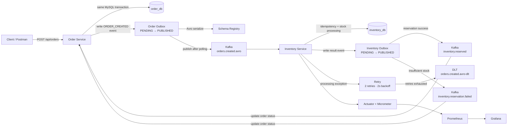
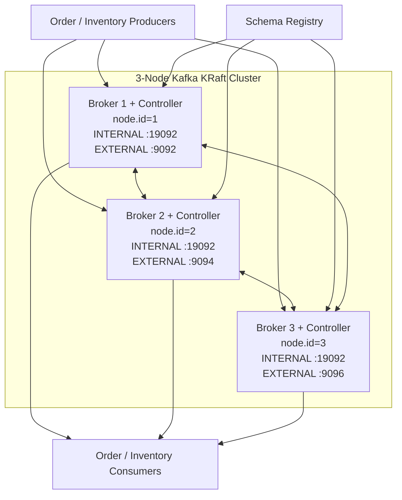
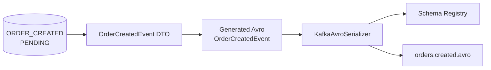
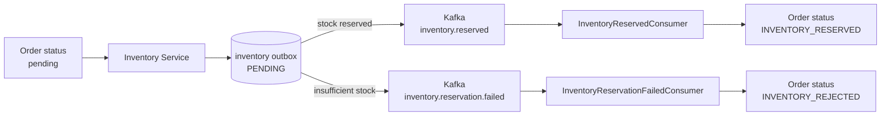

# Kafka Order Platform

## Project Overview

Kafka Order Platform is an event-driven backend project built with Java 17, Spring Boot, Apache Kafka, MySQL, Avro, and Docker.

The project contains two independent Spring Boot services:

- **order-service** — accepts order requests, stores order state in MySQL, writes events using the Transactional Outbox pattern, and publishes Avro events to Kafka.
- **inventory-service** — consumes Kafka events, validates and updates inventory inside a MySQL transaction, prevents duplicate processing, and manually acknowledges Kafka offsets after successful processing.

The platform implements production-style reliability and delivery practices such as:

- 3-node Kafka KRaft cluster
- Transactional Outbox pattern
- At-least-once event delivery
- Idempotent consumer processing
- Manual Kafka acknowledgment
- Retry with fixed backoff
- Dead Letter Topic (DLT)
- Avro serialization with Schema Registry
- MySQL transactional processing
- Spring Boot Actuator and Micrometer
- Prometheus and Grafana monitoring
- Grafana service-down alerting and recovery-state monitoring
- Dockerized services and infrastructure
- Jenkins CI/CD pipeline
- GitHub webhook-based automatic build triggering
- Versioned Docker images
- Docker Hub image publishing
- Approval-based deployment
- Post-deployment health verification

The goal of this project is not only to demonstrate a working Kafka producer-consumer flow, but also to show how common production-style failure scenarios—such as duplicate delivery, consumer crashes, publishing failures, retry exhaustion, schema communication delays, deployment failures, and service outages—can be handled, observed, and verified.

## Tech Stack

- Java 17
- Spring Boot
- Spring Kafka
- Apache Kafka
- Apache Avro
- Schema Registry
- Spring Data JPA
- Hibernate
- MySQL
- Maven
- Docker Compose
- Spring Boot Actuator
- Micrometer
- Prometheus
- Grafana
## Project Structure

```text
kafka-order-platform/
├── order-service/        # Produces order events
├── inventory-service/    # Consumes events and updates inventory
├── monitoring/           # Prometheus configuration
├── scripts/              # DLT and failure-testing scripts
├── docs/screenshots/     # Runtime proof screenshots
├── docker-compose.yml    # Kafka, Schema Registry, Prometheus and Grafana
├── .env.example          # Environment variable template
└── README.md
```

## Final Runtime Architecture

The runtime flow uses the Transactional Outbox pattern on both business sides so database changes and outgoing events are not treated as one unsafe dual-write operation.


```mermaid
flowchart LR
    Client[Client / Postman]
    OrderService[Order Service]
    OrderDB[(order_db)]
    OrderOutbox[Order Outbox\nPENDING → PUBLISHED]
    Schema[Schema Registry]
    KafkaOrder[Kafka\norders.created.avro]
    InventoryService[Inventory Service]
    InventoryDB[(inventory_db)]
    InventoryOutbox[Inventory Outbox\nPENDING → PUBLISHED]
    Reserved[Kafka\ninventory.reserved]
    Rejected[Kafka\ninventory.reservation.failed]
    Retry[Retry\n2 retries · 2s backoff]
    DLT[DLT\norders.created.avro-dlt]

    Actuator[Actuator + Micrometer]
    Prometheus[Prometheus]
    Grafana[Grafana]

    Client -->|POST /api/orders| OrderService
    OrderService -->|same MySQL transaction| OrderDB
    OrderService -->|write ORDER_CREATED event| OrderOutbox
    OrderOutbox -->|Avro serialize| Schema
    OrderOutbox -->|publish after polling| KafkaOrder

    KafkaOrder --> InventoryService
    InventoryService -->|idempotency + stock processing| InventoryDB
    InventoryService -->|write result event| InventoryOutbox

    InventoryOutbox -->|reservation success| Reserved
    InventoryOutbox -->|insufficient stock| Rejected

    Reserved -->|update order status| OrderService
    Rejected -->|update order status| OrderService

    InventoryService -->|processing exception| Retry
    Retry -->|retries exhausted| DLT

    InventoryService --> Actuator
    Actuator --> Prometheus
    Prometheus --> Grafana
```

### End-to-End Business Flow

1. The client sends `POST /api/orders` to `order-service`.
2. `order-service` stores the order and an `ORDER_CREATED` outbox row in MySQL within the same transaction.
3. The Order Outbox Publisher reads `PENDING` rows, converts the event to Avro, uses Schema Registry, and publishes to `orders.created.avro`.
4. After Kafka acknowledges the send, the outbox row is marked `PUBLISHED`; failed sends remain eligible for retry.
5. `inventory-service` consumes the Avro event, checks `eventId` for duplicate processing, and performs inventory work inside its MySQL transaction.
6. The inventory transaction also creates an outgoing result event in its outbox:
   - `inventory.reserved` when stock is reserved.
   - `inventory.reservation.failed` when stock is insufficient.
7. The Inventory Outbox Publisher publishes the result event to Kafka.
8. `order-service` consumes the result and updates the order to `INVENTORY_RESERVED` or `INVENTORY_REJECTED`.
9. Source-event processing uses manual acknowledgment; processing exceptions follow the configured retry policy and are recovered to `orders.created.avro-dlt` after retries are exhausted.
10. Actuator and Micrometer expose runtime metrics that Prometheus scrapes and Grafana visualizes.

### Reliability Boundaries

- **Order creation + order outbox:** one local MySQL transaction.
- **Inventory update + processed-event tracking + inventory outbox:** one local MySQL transaction.
- **Kafka delivery:** at-least-once, so consumers use `eventId`-based idempotency.
- **Kafka offset acknowledgment:** performed only after successful listener processing.
- **Outbox publication:** a row becomes `PUBLISHED` only after the Kafka send completes successfully.
- **Failure isolation:** bounded retries are followed by DLT recovery instead of infinite retry.

## Kafka Cluster Architecture

The local platform runs a **3-node Apache Kafka 4.3.1 KRaft cluster**. Each Kafka container is configured with both `broker` and `controller` roles, so the cluster does not depend on ZooKeeper.


```mermaid
flowchart TB
    Producer[Order / Inventory Producers]

    subgraph KafkaCluster[3-Node Kafka KRaft Cluster]
        B1[Broker 1 + Controller\nnode.id=1\nINTERNAL :19092\nEXTERNAL :9092]
        B2[Broker 2 + Controller\nnode.id=2\nINTERNAL :19092\nEXTERNAL :9094]
        B3[Broker 3 + Controller\nnode.id=3\nINTERNAL :19092\nEXTERNAL :9096]
    end

    Consumer[Order / Inventory Consumers]
    Registry[Schema Registry]

    Producer --> B1
    Producer --> B2
    Producer --> B3

    B1 <--> B2
    B2 <--> B3
    B3 <--> B1

    B1 --> Consumer
    B2 --> Consumer
    B3 --> Consumer

    Registry --> B1
    Registry --> B2
    Registry --> B3
```

### KRaft Controller Quorum

All three nodes participate in the controller quorum:

```text
1@kop-kafka-1:19093
2@kop-kafka-2:19093
3@kop-kafka-3:19093
```

KRaft manages Kafka cluster metadata and controller elections. Business records are still written to topic partition leaders and replicated between brokers.

### Internal vs External Listeners

Each broker exposes separate listeners for Docker-internal communication and Windows-host access.

| Broker | Docker internal listener | Host access |
|---|---|---|
| `kop-kafka-1` | `kop-kafka-1:19092` | `localhost:9092` |
| `kop-kafka-2` | `kop-kafka-2:19092` | `localhost:9094` |
| `kop-kafka-3` | `kop-kafka-3:19092` | `localhost:9096` |

The Spring Boot services use the host ports when running directly on Windows. When Jenkins deploys the services as Docker containers, the same applications use the internal broker addresses on the `kafka-order-platform_default` network.

### Replication and Durability Settings

The committed Docker configuration includes:

- `KAFKA_OFFSETS_TOPIC_REPLICATION_FACTOR=3`
- `KAFKA_TRANSACTION_STATE_LOG_REPLICATION_FACTOR=3`
- `KAFKA_TRANSACTION_STATE_LOG_MIN_ISR=2`
- persistent Docker volumes for each Kafka broker
- producer `acks=all` in `order-service`

For a replicated topic, the **leader** handles reads/writes and **followers** copy the partition data. The ISR (in-sync replica set) represents replicas sufficiently caught up with the leader.

> **Repository boundary:** the current repository does not contain a dedicated topic-provisioning script that declares the business-topic replication factor or `min.insync.replicas`. Those values should therefore be verified from the running Kafka topic configuration before they are presented as source-controlled settings.

### Kafka Network Paths

```text
Windows-host application
    -> localhost:9092 / 9094 / 9096

Docker-deployed application
    -> kop-kafka-1:19092
    -> kop-kafka-2:19092
    -> kop-kafka-3:19092

Kafka controllers
    -> broker-to-controller quorum on :19093
```

This separation prevents containers from advertising Windows-only `localhost` addresses to other containers while still allowing local development tools to connect from the host machine.

## Order Processing & Transactional Outbox

The Order Service accepts the HTTP request, persists the business order, and stores the outgoing event in an outbox row **inside the same MySQL transaction**. Kafka publishing happens afterward through a scheduled outbox publisher.

### Order API

```http
POST /api/orders
Content-Type: application/json
```

Request fields:

```json
{
  "productId": 501,
  "quantity": 2,
  "amount": 1499.00
}
```

Validation is applied before business processing:

- `productId` must be present and positive.
- `quantity` must be present and positive.
- `amount` must be present and at least `0.01`.

The client does not provide the database order ID. MySQL generates the numeric `orderId`, while the service also generates a unique `orderUuid`.

### Same-Transaction Write

`OrderApplicationService.createOrder()` is marked with `@Transactional`.

Within that transaction the service:

1. creates an `orders` row with initial status `pending`;
2. creates an `OrderCreatedEvent`;
3. serializes the event into the outbox payload;
4. creates an `outbox_events` row with:
   - `eventType = ORDER_CREATED`
   - `status = PENDING`
   - target topic = `orders.created.avro`;
5. commits the order and outbox row together.

```mermaid
flowchart LR
    Request[POST /api/orders] --> Controller[OrderController]
    Controller --> Service[OrderApplicationService\n@Transactional]
    Service --> OrderRow[(orders)]
    Service --> OutboxRow[(outbox_events\nORDER_CREATED · PENDING)]
```

This avoids the unsafe sequence of committing the order in MySQL and then depending on an immediate Kafka call to succeed before the event is durably recorded.

### HTTP Response

After the local database transaction succeeds, the controller returns:

```text
HTTP 202 Accepted
Order accepted and queued for publishing, orderId=<generated-id>
```

The response means the order and its outbox event were accepted locally. It does **not** mean Inventory Service has already processed the event.

### Outbox Publisher

`OutboxPublisher` runs every second and reads `PENDING` rows ordered by creation time.

For each row it:

```text
PENDING outbox row
    ↓
deserialize stored payload
    ↓
build Avro OrderCreatedEvent
    ↓
KafkaAvroSerializer + Schema Registry
    ↓
OrderEventProducer.publish()
    ↓
Kafka ACK
    ↓
mark outbox row PUBLISHED
```

The Kafka record key is the generated `orderId`, and the Avro event contains:

- `eventId`
- `orderId`
- `productId`
- `quantity`
- `amount`
- `status = CREATED`
- `occurredAt`
- `source = WEB`

### Publishing Reliability

The current Order Service configuration uses:

- producer `acks=all`;
- `max.block.ms=60000`;
- `delivery.timeout.ms=120000`;
- Schema Registry HTTP connect/read timeout = `60000 ms`;
- outbox publish wait = `130000 ms`.

The outbox row is changed to `PUBLISHED` only after the Kafka send completes successfully. If publishing fails or the publishing thread is interrupted, the row remains `PENDING` so it can be retried by a later scheduler run.

### Why the Outbox Pattern Is Used

Without the outbox, this failure window is possible:

```text
MySQL order commit
    ↓
application tries Kafka publish
    ↓
Kafka / network / Schema Registry failure
    ↓
order exists, but event may be missing
```

With the current design:

```text
Order + Outbox
same MySQL transaction
    ↓
commit succeeds
    ↓
event is durably available as PENDING
    ↓
publisher retries until Kafka publish succeeds
```

This does not make MySQL and Kafka one distributed transaction. Instead, it removes the direct dual-write dependency by making the database the durable source for pending publication.

## Inventory Processing, Idempotency & Manual Acknowledgment

The Inventory Service consumes `OrderCreatedEvent` records from `orders.created.avro` using consumer group `inventory-service-group`. Auto commit is disabled and the listener uses `manual_immediate` acknowledgment.

```text
spring.kafka.consumer.enable-auto-commit=false
spring.kafka.listener.ack-mode=manual_immediate
```

This keeps Kafka progress tied to the result of business processing instead of a timer-based auto commit.

### Consumer Flow

```mermaid
flowchart TD
    Kafka[orders.created.avro] --> Listener[InventoryEventConsumer]
    Listener --> Check{eventId already processed?}

    Check -->|Yes| Duplicate[Skip inventory update]
    Duplicate --> Ack1[Manual ACK]

    Check -->|No| Tx[InventoryProcessingService\n@Transactional]
    Tx --> Stock{Enough stock?}

    Stock -->|Yes| Update[Reduce available stock]
    Update --> Processed1[(processed_events)]
    Processed1 --> ReservedOutbox[(outbox_events\nINVENTORY_RESERVED · PENDING)]
    ReservedOutbox --> Commit1[Commit MySQL transaction]
    Commit1 --> Ack2[Manual ACK]

    Stock -->|No| NoStock[Keep stock unchanged]
    NoStock --> Processed2[(processed_events)]
    Processed2 --> FailedOutbox[(outbox_events\nINVENTORY_RESERVATION_FAILED · PENDING)]
    FailedOutbox --> Commit2[Commit MySQL transaction]
    Commit2 --> Ack3[Manual ACK]
```

### Idempotent Consumer

Every incoming business event has an `eventId`. Before changing inventory, `InventoryProcessingService` checks:

```text
processedEventRepository.existsByEventId(eventId)
```

The `processed_events.event_id` column is also declared `UNIQUE`.

If the event was already processed:

- the inventory lookup/update is skipped;
- no second stock deduction is performed;
- the listener logs `Duplicate event skipped`;
- the duplicate Kafka delivery is acknowledged.

This is important because Kafka delivery can repeat, for example when business work commits successfully but the consumer crashes before its offset is committed.

### Successful Reservation

For a new event with enough stock, one local MySQL transaction performs the business work:

1. loads inventory by `productId`;
2. records the incoming Kafka event in `processed_events`;
3. reduces `available_stock`;
4. updates `updated_at`;
5. creates an inventory outbox row:
   - topic: `inventory.reserved`
   - event type: `INVENTORY_RESERVED`
   - status: `PENDING`;
6. commits the transaction.

After `InventoryProcessingService.process()` returns successfully, the listener calls:

```java
acknowledgment.acknowledge();
```

Because the business method is transactional, a successful return means its transaction boundary has completed before the listener reaches the manual ACK call.

### Insufficient Stock Is a Business Result

Insufficient stock is handled differently from a technical processing failure.

When:

```text
availableStock < requestedQuantity
```

the service:

- does **not** reduce inventory;
- records the source event in `processed_events`;
- creates an `INVENTORY_RESERVATION_FAILED` outbox event;
- stores reason `Insufficient stock`;
- keeps the outgoing outbox row as `PENDING`;
- commits the transaction;
- acknowledges the source Kafka record.

So an expected business rejection becomes a result event for Order Service; it is not automatically treated as a retry/DLT error.

### Processed Event Audit Data

For each newly handled source event, `processed_events` stores:

| Field | Purpose |
|---|---|
| `event_id` | duplicate-detection key |
| `order_id` | business correlation |
| `topic_name` | source Kafka topic |
| `partition_id` | source partition |
| `kafka_offset` | source offset |
| `processed_at` | processing timestamp |

This gives both duplicate protection and a small audit trail linking the database work back to the consumed Kafka record.

### Concurrent Inventory Updates

The `Inventory` entity contains a JPA `@Version` field. Hibernate uses this version for optimistic locking so a concurrent conflicting inventory update is detected instead of silently overwriting another committed change.

Because the listener acknowledges only after the transactional processing call completes, a transaction failure does not reach the normal ACK line.

### Verification in Tests

The repository includes focused tests for this behavior:

- `shouldSkipInventoryUpdateWhenAlreadyProcessed()` verifies a duplicate does not touch the inventory repository.
- `shouldUpdateInventoryWhenEventIsNew()` verifies stock is reduced for a new event.
- `shouldSaveFailureEventWhenStockIsInsufficient()` verifies stock stays unchanged and a `PENDING` rejection outbox event is created.
- `InventoryDatabaseIntegrationTest` verifies against MySQL that inventory and the processed-event record are stored together for a successful event.

### Failure Window This Design Protects

```text
Kafka delivers event
    ↓
MySQL transaction succeeds
    ↓
consumer crashes before offset commit
    ↓
Kafka redelivers same event
    ↓
eventId already exists
    ↓
business update is skipped
    ↓
offset can be acknowledged safely
```

This is the project's main protection against duplicate business effects while still using at-least-once Kafka delivery.

## Retry, Error Handling, DLT & Replay

Technical failures in the Inventory consumer are handled by Spring Kafka's `DefaultErrorHandler`. Expected business outcomes such as insufficient stock are handled inside the business transaction and are **not** sent through the technical retry/DLT path.

### Retry Policy

The committed error-handler configuration uses:

```java
new FixedBackOff(2000L, 2L)
```

That means:

```text
Initial processing attempt
    ↓ failure
wait 2 seconds
    ↓
Retry 1
    ↓ failure
wait 2 seconds
    ↓
Retry 2
    ↓ failure
publish to DLT
```

So a failing record can be processed **up to three times total**: one initial attempt plus two retries.

### DLT Routing

After retries are exhausted, `DeadLetterPublishingRecoverer` sends the record to:

```text
<original-topic>-dlt
```

For the current Avro source topic:

```text
orders.created.avro
        ↓
orders.created.avro-dlt
```

The recoverer keeps the same partition number as the failed source record.

Additional safeguards in the current configuration:

- `setFailIfSendResultIsError(true)` prevents a failed DLT publish from being treated as successful recovery.
- `setCommitRecovered(true)` allows the recovered source offset to be committed after successful DLT recovery, preventing the same poison record from blocking normal consumption indefinitely.

### Technical Failure vs Business Rejection

These two paths are intentionally different:

| Scenario | Handling |
|---|---|
| Inventory exists but stock is insufficient | Create `INVENTORY_RESERVATION_FAILED` business event, commit, ACK source record |
| Inventory row is missing / processing throws | Retry twice with 2-second backoff |
| Technical failure still exists after retries | Publish source record to `orders.created.avro-dlt` |

This separation prevents normal business rejection from being mistaken for an infrastructure/application failure.

### DLT Failure Metadata

Spring Kafka attaches recovery headers to DLT records. The integration test verifies important metadata including:

- original Kafka topic;
- exception cause class;
- exception message;
- original event key and Avro payload.

The test deliberately publishes an order event with `productId=999`. Because no inventory row exists for that product, processing throws `IllegalArgumentException`, retries are exhausted, and the record is recovered to the DLT.

### DLT Inspection Consumer

`InventoryDltConsumer` uses a separate consumer group:

```text
inventory-dlt-inspection-group
```

It consumes raw DLT bytes, then explicitly uses `KafkaAvroDeserializer` with Schema Registry to decode the original `OrderCreatedEvent`.

```text
orders.created.avro-dlt
    ↓
ByteArrayDeserializer
    ↓
KafkaAvroDeserializer
    ↓
log orderId / productId / quantity / amount / occurredAt
    ↓
manual ACK
```

This keeps DLT inspection separate from the normal `inventory-service-group` business consumer.

### Replay Support — Current Repository Boundary

The repository contains `InventoryDltReplayRunner`, enabled only when:

```properties
app.dlt.replay.enabled=true
```

The normal application configuration keeps this disabled:

```properties
app.dlt.replay.enabled=false
```

The current runner is a **controlled proof-of-concept replay utility**, not a general production replay engine. In the committed code it:

- assigns directly to DLT partition `1`;
- scans from the beginning for up to 30 seconds;
- matches one hard-coded `orderId` and `eventId`;
- republishes only that matching Avro event to `orders.created.avro`;
- exits after the replay succeeds.

A production-grade replay process would remove those hard-coded identifiers and add operator-controlled selection, auditability, authorization, replay limits, and explicit duplicate/replay policies.

### Verification

The repository contains `InventoryRetryToDltIntegrationTests`, which starts an embedded Kafka broker and verifies that a deliberately failing Avro event reaches `orders.created.avro-dlt` with the expected failure metadata.

> **Legacy utility note:** files under `scripts/` were created during an earlier pre-Avro phase and still reference `orders.created-dlt`. The current Java configuration and integration test use `orders.created.avro-dlt`; therefore the Java implementation is the source of truth until those helper scripts are modernized.

## Avro, Schema Registry & Schema Evolution

The `orders.created.avro` flow uses Apache Avro as the event contract between Order Service and Inventory Service. Both services keep the same `OrderCreatedEvent` schema under `src/main/avro/order-created.avsc`, and Maven generates the Java `SpecificRecord` class during the `generate-sources` phase.

### OrderCreatedEvent Contract

| Field | Avro type | Purpose |
|---|---|---|
| `eventId` | `string` | unique event identity used for idempotency |
| `orderId` | `long` | business order correlation |
| `productId` | `long` | inventory product |
| `quantity` | `int` | requested quantity |
| `amount` | decimal logical type | order amount, precision `19`, scale `2` |
| `status` | `string` | event state such as `CREATED` |
| `occurredAt` | timestamp-millis logical type | event creation time |
| `source` | `string`, default `UNKNOWN` | event source / schema-evolution field |

The generated record namespace is:

```text
com.aryan.kafka.avro.OrderCreatedEvent
```

### Build-Time Code Generation

Both services use:

```text
org.apache.avro:avro-maven-plugin:1.12.1
```

during Maven `generate-sources`.

```text
src/main/avro/order-created.avsc
        ↓
avro-maven-plugin
        ↓
target/generated-sources/avro
        ↓
com.aryan.kafka.avro.OrderCreatedEvent
```

The plugin is configured with:

- `stringType = String`
- decimal logical-type support enabled

This keeps the producer and consumer strongly typed instead of passing an unstructured JSON string for the main order-created event.

### Producer Serialization Path

Order Service converts the durable outbox payload into the generated Avro type before publishing.


```mermaid
flowchart LR
    Outbox[(ORDER_CREATED\nPENDING)] --> JavaEvent[OrderCreatedEvent DTO]
    JavaEvent --> AvroRecord[Generated Avro\nOrderCreatedEvent]
    AvroRecord --> Serializer[KafkaAvroSerializer]
    Serializer --> Registry[Schema Registry]
    Serializer --> Kafka[orders.created.avro]
```

Current producer configuration:

```properties
spring.kafka.producer.value-serializer=io.confluent.kafka.serializers.KafkaAvroSerializer
spring.kafka.producer.properties.schema.registry.url=http://localhost:8081
```

The Order Outbox Publisher explicitly maps the stored event to Avro and sets:

```text
source = WEB
```

before sending it to Kafka.

### Consumer Deserialization Path

Inventory Service consumes the same event as the generated Avro type.

```properties
spring.kafka.consumer.value-deserializer=org.springframework.kafka.support.serializer.ErrorHandlingDeserializer
spring.kafka.consumer.properties.spring.deserializer.value.delegate.class=io.confluent.kafka.serializers.KafkaAvroDeserializer
spring.kafka.consumer.properties.specific.avro.reader=true
```

The flow is:

```text
orders.created.avro
    ↓
ErrorHandlingDeserializer
    ↓
KafkaAvroDeserializer
    ↓
Schema Registry
    ↓
com.aryan.kafka.avro.OrderCreatedEvent
    ↓
InventoryEventConsumer
```

`ErrorHandlingDeserializer` wraps the Avro deserializer so deserialization problems can be surfaced to Spring Kafka's error-handling infrastructure instead of being hidden inside the business listener.

### Schema Registry Runtime

Docker Compose runs Confluent Schema Registry as:

```text
kop-schema-registry
host port: 8081
container port: 8081
```

Schema Registry stores its metadata in Kafka using all three internal broker addresses:

```text
kop-kafka-1:19092
kop-kafka-2:19092
kop-kafka-3:19092
```

Its internal Kafka store topic is configured with replication factor `3`.

Connection path depends on where the Spring Boot application runs:

| Runtime | Schema Registry URL |
|---|---|
| application running on Windows host | `http://localhost:8081` |
| Jenkins-deployed Docker container | `http://kop-schema-registry:8081` |

### Schema Evolution Demonstrated

The current schema contains the later-added field:

```json
{
  "name": "source",
  "type": "string",
  "default": "UNKNOWN"
}
```

Providing a default is the Avro-compatible pattern used when a newer reader needs a field that older records may not contain. New events produced by Order Service set `source=WEB`, while the default gives the reader a value when that field is absent in older compatible data.

Inventory Service also logs the field during consumption:

```text
Schema evolution check: orderId=<id>, source=<value>
```

> **Compatibility boundary:** the repository demonstrates a schema-evolution-friendly field change, but it does not source-control a Schema Registry compatibility mode such as BACKWARD or FULL. The README therefore does not claim that Registry-level compatibility enforcement is configured.

### DLT and Avro

When an Avro `OrderCreatedEvent` exhausts retries, the DLT path preserves the event as an Avro record. `InventoryDltConsumer` reads the DLT value as bytes and explicitly uses `KafkaAvroDeserializer` plus Schema Registry to reconstruct the original `OrderCreatedEvent`.

The retry-to-DLT integration test also deserializes the DLT value with `KafkaAvroDeserializer`, verifying that the failed record remains readable as the same Avro event type.

### Event-Format Boundary

Avro is currently used for the main Order Service → Inventory Service `orders.created.avro` contract and its DLT path.

The Inventory Service result events:

```text
inventory.reserved
inventory.reservation.failed
```

are currently serialized as JSON by `InventoryValueSerializer`. This is intentional documentation of the **current repository state**; the project does not claim that every Kafka topic uses Avro.

## Inventory Result Events & Order Status Lifecycle

The platform does not stop after Inventory Service updates stock. Inventory publishes a result event back to Kafka, and Order Service consumes that result to move the order to its next business state.

### Result Event Flow


```mermaid
flowchart LR
    Pending[Order status\npending]

    Inventory[Inventory Service]
    InvOutbox[(inventory outbox\nPENDING)]
    ReservedTopic[Kafka\ninventory.reserved]
    FailedTopic[Kafka\ninventory.reservation.failed]

    ReservedConsumer[InventoryReservedConsumer]
    FailedConsumer[InventoryReservationFailedConsumer]

    Reserved[Order status\nINVENTORY_RESERVED]
    Rejected[Order status\nINVENTORY_REJECTED]

    Pending --> Inventory
    Inventory --> InvOutbox

    InvOutbox -->|stock reserved| ReservedTopic
    InvOutbox -->|insufficient stock| FailedTopic

    ReservedTopic --> ReservedConsumer
    FailedTopic --> FailedConsumer

    ReservedConsumer --> Reserved
    FailedConsumer --> Rejected
```

### Inventory Result Events

Inventory creates one of two JSON result events inside its business transaction.

| Result | Kafka topic | Event type | Meaning |
|---|---|---|---|
| reservation successful | `inventory.reserved` | `INVENTORY_RESERVED` | requested stock was reserved |
| insufficient stock | `inventory.reservation.failed` | `INVENTORY_RESERVATION_FAILED` | request was handled but stock was not available |

Both result event types carry correlation data:

- a new result `eventId`;
- `sourceEventId` pointing back to the original order-created event;
- `orderId`;
- `productId`;
- `quantity`;
- result `status`;
- result timestamp;
- rejection `reason` for the failure event.

This allows Order Service to correlate an asynchronous inventory response with the original order flow.

### Inventory Outbox Publication

The Inventory Outbox Publisher runs every second and reads `PENDING` result rows.

```text
Inventory transaction
    ↓
result event stored as PENDING
    ↓
Inventory Outbox Publisher
    ↓
JSON serialization
    ↓
Kafka publish using orderId as key
    ↓
Kafka send completes
    ↓
outbox row becomes PUBLISHED
```

If the publisher throws while sending, the row is not changed to `PUBLISHED`, so it remains available for a later scheduler run.

> **Current implementation boundary:** unlike the Order Outbox Publisher, the Inventory Outbox Publisher currently waits on `KafkaTemplate.send(...).get()` without its own explicit application-level timeout. The documentation therefore does not claim identical timeout hardening on both outbox publishers.

### Order Service Result Consumers

Order Service consumes the two result topics using consumer group:

```text
order-service-group
```

Auto commit is disabled and the listeners use:

```properties
spring.kafka.consumer.enable-auto-commit=false
spring.kafka.listener.ack-mode=manual_immediate
```

The result topics use JSON deserialization rather than Avro.

### Successful Order Path

For `inventory.reserved`:

1. `InventoryReservedConsumer` receives the result.
2. Order Service checks whether the result `eventId` already exists in its own `processed_events` table.
3. If it is new, the order is loaded by `orderId`.
4. Order status becomes `INVENTORY_RESERVED`.
5. The consumed result event is saved to `processed_events`.
6. The transaction completes.
7. The Kafka offset is manually acknowledged.

```text
pending
  ↓
inventory.reserved
  ↓
INVENTORY_RESERVED
```

### Rejected Order Path

For `inventory.reservation.failed`:

1. `InventoryReservationFailedConsumer` receives the JSON event.
2. Order Service performs the same `eventId` duplicate check.
3. The matching order is loaded.
4. Order status becomes `INVENTORY_REJECTED`.
5. The result event is saved in `processed_events`.
6. The transaction completes.
7. The Kafka offset is manually acknowledged.

```text
pending
  ↓
inventory.reservation.failed
  ↓
INVENTORY_REJECTED
```

The failure event also carries the business reason, currently:

```text
Insufficient stock
```

### Idempotency on the Return Path

Order Service applies idempotency to inventory result events too.

The `processed_events.event_id` column is unique, and before changing order status the service checks:

```text
processedEventRepository.existsByEventId(eventId)
```

If Kafka redelivers the same reservation or rejection event:

```text
duplicate result event
    ↓
eventId already exists
    ↓
order status is not updated again
    ↓
duplicate is logged
    ↓
Kafka offset is acknowledged
```

So idempotency exists on **both sides** of the asynchronous business flow:

```text
OrderCreatedEvent
    ↓
Inventory Service idempotency
    ↓
Inventory result event
    ↓
Order Service idempotency
```

### Transactional Status Update Hardening

During this documentation review, the reservation-success path was found to be missing `@Transactional` on `markInventoryReserved(...)`, while the rejection path already had it.

The success path was corrected so that:

```text
order status update
        +
processed-event insert
        ↓
same Order Service MySQL transaction
```

This keeps the reservation and rejection consumers consistent and closes a failure window where the order status and processed-event marker could otherwise have been committed independently.

### Technical Failure State

A technical Inventory processing failure is different from a business rejection.

If the original `OrderCreatedEvent` exhausts retries and goes to `orders.created.avro-dlt`, the current code does **not** automatically publish an inventory rejection result to Order Service.

Therefore, in the current implementation, that order can remain in `pending` until the failed event is investigated and successfully replayed or another recovery action is taken.

This distinction is intentional in the documentation:

- **insufficient stock** → handled business result → `INVENTORY_REJECTED`;
- **technical processing failure** → Retry → DLT → operator/recovery workflow.

## Monitoring, Metrics & Alerting

The platform uses Spring Boot Actuator, Micrometer, Prometheus, and Grafana to make application health and JVM/runtime behavior visible during local and CI/CD testing.

### Monitoring Flow

```mermaid
flowchart LR
    App[Inventory Service\n:8082]
    Actuator[Spring Boot Actuator]
    Micrometer[Micrometer]
    Endpoint[/actuator/prometheus]
    Prometheus[Prometheus\n:9090]
    Grafana[Grafana\n:3000]
    Alert[Grafana Alert Rule]
    Notify[Optional Email Notification]

    App --> Actuator
    Actuator --> Micrometer
    Micrometer --> Endpoint
    Endpoint --> Prometheus
    Prometheus --> Grafana
    Grafana --> Alert
    Alert -. SMTP enabled locally .-> Notify
```

### What Each Layer Does

| Component | Responsibility in this project |
|---|---|
| Spring Boot Actuator | exposes application health and management endpoints |
| Micrometer | publishes JVM/application metrics in a meter-based format |
| Prometheus | scrapes and stores the metrics time series |
| Grafana | queries Prometheus and visualizes the metrics |
| Grafana Alerting | evaluates service-availability conditions and tracks firing/resolved states |

Both Spring Boot services expose:

```text
/actuator/health
/actuator/prometheus
```

through:

```properties
management.endpoints.web.exposure.include=health,prometheus
```

### Current Prometheus Target

The committed `monitoring/prometheus.yml` currently scrapes **Inventory Service** every five seconds:

```yaml
global:
  scrape_interval: 5s

scrape_configs:
  - job_name: 'inventory-service'
    metrics_path: '/actuator/prometheus'
    static_configs:
      - targets: ['host.docker.internal:8082']
```

So the current source-controlled monitoring path is:

```text
inventory-service :8082
        ↓
/actuator/prometheus
        ↓
Prometheus :9090
        ↓
Grafana :3000
```

> **Current repository boundary:** Order Service exposes a Prometheus endpoint too, but the committed `prometheus.yml` does not currently scrape it. The documentation therefore does not claim full two-service Prometheus coverage.

### Useful Health and Metrics Endpoints

When the services are running locally:

| Purpose | Endpoint |
|---|---|
| Order Service health | `http://localhost:8080/actuator/health` |
| Order Service Prometheus metrics | `http://localhost:8080/actuator/prometheus` |
| Inventory Service health | `http://localhost:8082/actuator/health` |
| Inventory Service Prometheus metrics | `http://localhost:8082/actuator/prometheus` |
| Prometheus UI | `http://localhost:9090` |
| Grafana UI | `http://localhost:3000` |

### Service Availability with the `up` Metric

Prometheus exposes an `up` series for each scrape target:

```text
up = 1  → target scrape succeeded
up = 0  → target scrape failed
```

The local Grafana alerting demo used this availability signal to observe the Inventory Service going down and later recovering.

```text
Inventory Service healthy
        ↓
Prometheus up = 1
        ↓
service stops / becomes unreachable
        ↓
Prometheus up = 0
        ↓
Grafana alert → FIRING
        ↓
service returns
        ↓
Prometheus up = 1
        ↓
Grafana alert → RESOLVED
```

### Dashboard Coverage

The committed runtime evidence shows a Grafana dashboard used to visualize:

- Inventory Service availability;
- CPU/runtime activity;
- JVM heap-memory usage.

The Grafana container uses the named volume:

```text
grafana-data:/var/lib/grafana
```

so UI-created dashboards, data-source configuration, and alert state/configuration can survive container recreation on the same Docker installation.

> **Provisioning boundary:** the repository does not contain Grafana dashboard JSON or alert-rule provisioning files. The demonstrated dashboard and alert were configured in the local Grafana instance and persisted in the Docker volume rather than source-controlled as code.

### Alerting and Email Notification Boundary

The repository contains screenshot evidence for both alert states:

- `docs/screenshots/grafana-alert-firing.png`
- `docs/screenshots/grafana-alert-resolved.png`

Email notification was also exercised during the local monitoring work, using SMTP credentials kept outside Git.

However, the **current committed Docker Compose configuration intentionally has SMTP disabled by default**:

```yaml
GF_SMTP_ENABLED: "false"
```

Therefore:

```text
Grafana alert evaluation      → available in current setup
FIRING / RESOLVED state       → demonstrated
SMTP email delivery           → opt-in, not enabled by default in committed Compose
```

The repository's `.env.example` keeps only safe placeholder values for an optional local SMTP setup. Real SMTP credentials must never be committed.

### Runtime Evidence Already in the Repository

The following screenshots are already committed under `docs/screenshots/`:

| Evidence | File |
|---|---|
| Prometheus target reachable | `prometheus-target-up.png` |
| Grafana monitoring dashboard | `grafana-monitoring-dashboard.png` |
| Service-down alert firing | `grafana-alert-firing.png` |
| Service recovery / resolved state | `grafana-alert-resolved.png` |

These images provide runtime proof of the monitoring path instead of relying only on configuration files.

### Monitoring Scope Summary

```text
Actuator
  exposes health + metrics
        ↓
Micrometer
  instruments / formats metrics
        ↓
Prometheus
  scrapes inventory-service every 5s
        ↓
Grafana
  dashboard + alert evaluation
        ↓
Optional notification channel
  enabled only when SMTP is explicitly configured
```

## Failure Scenarios, Recovery & Production-Readiness Fixes

This project was hardened by deliberately testing failure windows and by fixing issues discovered during local end-to-end runs and CI/CD work. The goal is not to claim a full production environment; it is to show production-style failure handling with observable recovery behavior.

### Failure Matrix

| Failure scenario | Risk | Protection / fix |
|---|---|---|
| consumer crashes after DB commit but before Kafka offset commit | duplicate stock update on redelivery | `eventId` idempotency + unique `processed_events.event_id` |
| Order outbox publish stalls or fails | event row can be marked published incorrectly or scheduler can wait indefinitely | bounded wait, correlated logs, interruption handling, keep row `PENDING` on failure |
| Schema Registry is slow/unavailable | Avro serialization can block before Kafka send future is returned | explicit Registry HTTP limits + outbox timeout sized beyond Kafka delivery timeout |
| poison event keeps failing | consumer can repeatedly hit the same bad record | 2 retries with 2-second backoff, then DLT recovery |
| Docker/Kafka local resource pressure | brokers/Registry may start slowly or fail health checks | operational recovery + bounded health checks; no claim of unlimited local capacity |
| deployment container starts before app is ready | pipeline can treat container start as successful application readiness | retry the complete Actuator health predicate |
| insufficient stock | business rejection could be confused with a technical error | publish `INVENTORY_RESERVATION_FAILED`, do not send it to DLT |

### 1. Duplicate After Database Commit but Before Offset Commit

The important at-least-once delivery window is:

```text
Kafka delivers event
    ↓
Inventory MySQL transaction commits
    ↓
process crashes before Kafka offset commit
    ↓
same Kafka record is delivered again
```

Without idempotency, the second delivery could reduce stock twice.

The implemented protection is:

```text
eventId
  ↓
processed_events.event_id UNIQUE
  ↓
already processed?
  ├─ yes → skip business update → ACK
  └─ no  → process transaction → save marker → ACK
```

This design was verified with duplicate-processing tests and end-to-end duplicate scenarios: the redelivered event is recognized while the business effect is not applied a second time.

### 2. Outbox Publish Stall & Schema Registry Delay

During an earlier local debugging run, an apparent Order Outbox publishing "hang" was traced to synchronous Avro schema work:

```text
OutboxPublisher
    ↓
OrderEventProducer.publish(...)
    ↓
KafkaAvroSerializer
    ↓
Schema Registry registerSchema
    ↓
HTTP response wait
    ↓
only then can kafkaTemplate.send(...) return its future
```

One observed schema-registration request took about **26.9 seconds**. A temporary 10-second Registry HTTP limit proved too aggressive during cold startup, so the final source configuration was restored to 60-second Registry HTTP connect/read limits.

The hardened Order publisher now uses:

```text
Schema Registry HTTP connect/read : 60 s
Kafka delivery timeout            : 120 s
Outbox acknowledgment wait        : 130 s
```

The 130-second application wait is intentionally longer than Kafka's 120-second delivery deadline.

Additional hardening added in commit `3bf2d391`:

- log the publish attempt with `eventId`, topic, and `orderId`;
- wait with an explicit timeout instead of unbounded `.get()`;
- preserve the Java thread interruption flag;
- stop the current batch after interruption;
- leave the outbox row `PENDING` on timeout, serialization error, broker failure, or interruption;
- mark `PUBLISHED` only after a successful Kafka send result.

The repository also contains `OutboxPublisherTest` cases covering successful ACK, timeout/retry, asynchronous broker failure, synchronous serialization failure, interruption, and empty polls.

A later end-to-end verification completed with the outbox row published, Inventory processing completed, the order reaching `INVENTORY_RESERVED`, and no pending Order outbox rows left from that verification run.

### 3. Poison Event → Retry → DLT

A technical failure is allowed to fail the listener instead of being manually acknowledged.

Current policy:

```text
attempt 1
  ↓ fail
2-second wait
  ↓
attempt 2
  ↓ fail
2-second wait
  ↓
attempt 3
  ↓ fail
orders.created.avro-dlt
```

The embedded-Kafka integration test deliberately sends an event for a missing inventory product and verifies:

- the event reaches `orders.created.avro-dlt`;
- the key and Avro payload are preserved;
- the original-topic header is present;
- the exception class and message are present.

After successful DLT recovery, `setCommitRecovered(true)` lets the consumer move past that poison record instead of retrying it forever.

### 4. Business Failure Is Not a Technical Failure

Insufficient stock is a valid business outcome:

```text
inventory exists
    +
requested quantity > available stock
    ↓
INVENTORY_RESERVATION_FAILED
    ↓
inventory.reservation.failed
    ↓
Order → INVENTORY_REJECTED
```

It is committed and acknowledged normally.

By contrast:

```text
missing inventory row / unexpected exception
    ↓
retry
    ↓
DLT if still failing
```

Keeping these paths separate prevents expected business rejection from polluting the technical-error channel.

### 5. Local Docker / Kafka Resource-Pressure Incident

During a heavy local run, Docker Desktop and the 3-node KRaft stack showed resource pressure together with intermittent broker/startup failures and slow infrastructure recovery.

The environment was an **8 GB development laptop**, so this observation is treated as an operational constraint, not proof of a Kafka design defect.

Recovery work included reducing concurrent local load, stopping nonessential monitoring containers temporarily, restarting the Kafka brokers, and then starting Schema Registry after broker health recovered.

The lesson recorded from this incident is:

```text
local resource pressure
        ≠
application architecture failure
```

and also:

```text
dependency healthy
    before
dependent service starts
```

The committed Compose file reflects that dependency ordering by starting Schema Registry only after all three Kafka brokers report healthy.

> **Root-cause boundary:** resource pressure was a contributing condition observed during the incident; the project does not claim it was the single proven root cause of every broker or Registry timeout.

### 6. Jenkins Deployment Health-Check Bug

The first deployment health check used a form similar to:

```text
curl --retry ... /actuator/health | grep '"status":"UP"'
```

That retried the HTTP command, but not necessarily the complete application-readiness predicate. A response that did not yet satisfy the `UP` check could still make the pipeline fail before the whole readiness check was retried.

The fixed Jenkins stage now retries the **entire** condition:

```text
curl succeeds
        +
response contains "status":"UP"
        ↓
application is ready
```

Current behavior for each service:

- up to 30 checks;
- 3-second delay between checks;
- fail the pipeline only after the final unsuccessful check.

```text
Container running
      ≠
Application ready
```

This is why deployment success is validated through Actuator instead of relying only on `docker run -d`.

### 7. Recovery Principles Used Across the Project

```text
Database consistency      → local @Transactional boundaries
Duplicate delivery        → eventId idempotency
Unsafe DB + Kafka write   → Transactional Outbox
Transient consumer error  → bounded retry
Repeated technical error  → DLT
Outbox send uncertainty   → remain PENDING
Deployment readiness      → Actuator health verification
Observability             → Prometheus + Grafana
```

These mechanisms solve different failure windows; none of them is presented as a single "exactly-once for everything" guarantee.

## Key Interview Concepts

- Kafka producer and consumer flow
- Kafka partitions, offsets and consumer groups
- Manual acknowledgment
- At-least-once delivery
- Idempotent event processing
- Database transaction boundaries
- Retry and Dead Letter Topic (DLT)
- Avro serialization and Schema Registry
- Transactional Outbox pattern
- Consumer failure and recovery
- Prometheus metrics
- Grafana monitoring and alerting\n\n## Key Engineering Decisions

- **Manual Kafka acknowledgment** is used so an offset is acknowledged only after successful business processing.
- **Idempotency** prevents duplicate Kafka delivery from updating inventory more than once.
- **Database transactions** keep inventory updates and processed-event tracking consistent.
- **Retry + DLT** isolates repeatedly failing records without blocking normal event processing.
- **Avro + Schema Registry** provides schema-based communication between producer and consumer.
- **Prometheus + Grafana** provides runtime visibility and service-down alerting.
- **Docker volumes** preserve Kafka and Grafana data across container recreation.
## How to Run

### Prerequisites

- Java 17
- Docker Desktop
- Maven / Maven Wrapper
- MySQL

### 1. Start Infrastructure

From the project root:

```powershell
docker compose up -d
```

This starts the Kafka cluster, Schema Registry, Prometheus, and Grafana.

### 2. Start Inventory Service

```powershell
cd inventory-service
.\mvnw.cmd spring-boot:run
```

`inventory-service` runs on port `8082`.

### 3. Start Order Service

Open another terminal:

```powershell
cd order-service
.\mvnw.cmd spring-boot:run
```

### 4. Verify Monitoring

Prometheus:

```text
http://localhost:9090
```

Grafana:

```text
http://localhost:3000
```
## Environment Setup

The committed Docker Compose setup does not require SMTP credentials for normal Kafka, Schema Registry, Prometheus, or Grafana startup.

For optional Grafana email-notification testing, a safe placeholder template is kept in:

```text
.env.example
```

The current `docker-compose.yml` keeps:

```yaml
GF_SMTP_ENABLED: "false"
```

so SMTP is **disabled by default** and the placeholder values are not consumed unless SMTP configuration is explicitly wired back into the local Compose setup.

Never commit a real Gmail App Password, Docker Hub token, webhook secret, or any other credential.

## Screenshots

### Prometheus Target Health


### Grafana Monitoring Dashboard


### Service Down Alert


### Service Recovery
